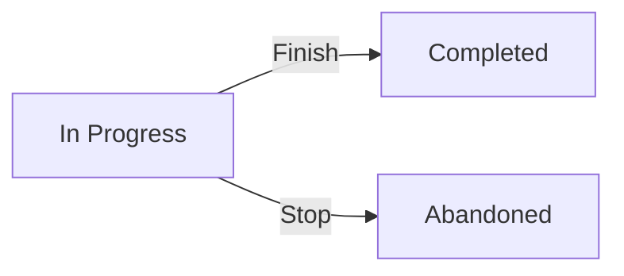

# rxlog
**An app to manage my reading workflow for books.**

The name **rxlog** combines **reading** with **UX (user experience)**.  
While typical apps focus on digital interaction, rxlog is designed to give me a structured, almost tangible experience of managing my physical book reading workflow.


Rxlog is a personal reading manager that helps you organize, track, and streamline your book reading workflow.

---

## ✨ Features
- Register physical books (start as *in progress*)
- Track statuses: *in progress* → *completed* or *abandoned*
- Mark **Toptitel** (page-turner)
- See progress overview at a glance
- Clean React UI (Vite + React Router)

---

## 🛠 Tech Stack
- **Frontend:** React + Vite
- **Routing:** React Router DOM
- **Linting:** ESLint
- **Build:** Vite
- **Backend:** Node.js (Express) + MongoDB (Mongoose)
- **Testing:** Jest (backend)
- **CI/CD:** GitHub Actions
- **Containerization:** Docker + Docker Compose

---

## 🚀 Quickstart

### Local development
```bash
# Backend
cd backend
npm install
cp ../.env.example .env
npm run dev

# Frontend (in another terminal)
cd frontend
npm install
npm run dev

# With Docker

cp .env.example .env
docker compose up --build
Frontend → http://localhost:8080
Backend API → http://localhost:4000/api/books
```

## 📈 Reading Workflow



## 🏗 Architecture

```mermaid
flowchart LR
    subgraph Client
      UI[React (Vite + Router)]
    end

    subgraph Server
      API[Node.js + Express API]
    end

    subgraph Database
      DB[(MongoDB via Mongoose)]
    end

    UI -->|HTTP /api/*| API
    API -->|CRUD| DB
```

## 🗺 Roadmap
- Native Apps for Android and iOS to query and update reading-data
- AI supported auto-complete of book-information
- Analytic tools to create reading profiles
- Tools to improve quality of imported historic book-data
- Add wishlist status for books not yet owned
- Import/export from external services (Goodreads, Pocket, …)
- Mobile-friendly layout
- Recommendation engine

## 📄 License
[MIT](LICENSE)

